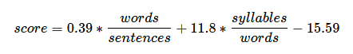
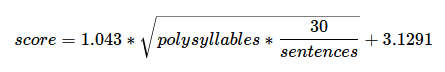
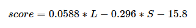

# Work on project. Stage 4/4: More parameters

## Description

In this stage, you should implement various other scientific approaches to calculate a readability score.

Take a look at different ages and corresponding scores in the table in this article. This table is suitable for all the algorithms described in this stage. To calculate the age use the upper bound of the range. For example, if the range is 12-13 year olds then it's upper bound is 13 year olds.

1. The first algorithm is **Flesch–Kincaid readability tests**. First, you need to create a method that calculates a number of syllables in a word. The formula is given below. You can find more information [here](https://en.wikipedia.org/wiki/Flesch%E2%80%93Kincaid_readability_tests). You can use the second formula to calculate the index; it allows you to easily calculate the age of a person using the same table from the Automated Readability Index.
   
    

2. The second one is SMOG index. It stands for Simple Measure of Gobbledygook. To calculate it, you need to count the number of polysyllables which is the number of words with more than 2 syllables. The formula is shown below. You can find out more [here](https://en.wikipedia.org/wiki/SMOG). The Wikipedia page says that at least 30 sentences are required for this index to work properly. Don't pay attention to this, just keep it in mind when you use this index in real life. As in the previous example, the grade level is calculated here, so to get the age of a person you need to use the table from the first link.

    

   
3. The next one is Coleman–Liau index. The formula is given below. For more information read [this](https://en.wikipedia.org/wiki/Coleman%E2%80%93Liau_index). L is the average number of characters per 100 words and S is the average number of sentences per 100 words. Like all other indices, the output is a person's grade level. Like all other indices, the result is a minimum grade level required to understand this text.

    

   
4. So, in this stage, you should program all three approaches. Don't forget about the Automated readability index! Also, there should be an option to choose all methods at the same time.

To count the number of syllables you should use letters a, e, i, o, u, y as vowels. You can see here examples and intricacies with determining vowels in a word with 100% accuracy. So, let's use the following 4 rules:

1. Count the number of vowels in the word.
2. Do not count double-vowels (for example, "rain" has 2 vowels but only 1 syllable).
3. If the last letter in the word is 'e' do not count it as a vowel (for example, "side" has 1 syllable).
4. If at the end it turns out that the word contains 0 vowels, then consider this word as a 1-syllable one.

#Example

The symbol > represents the user input. Note that it's not part of the input.

    > java Main in.txt
    The text is:
    This is the front page of the Simple English Wikipedia. Wikipedias are places where people work together to write encyclopedias in different languages. We use Simple English words and grammar here. The Simple English Wikipedia is for everyone! That includes children and adults who are learning English. There are 142,262 articles on the Simple English Wikipedia. All of the pages are free to use. They have all been published under both the Creative Commons License and the GNU Free Documentation License. You can help here! You may change these pages and make new pages. Read the help pages and other good pages to learn how to write pages here. If you need help, you may ask questions at Simple talk. Use Basic English vocabulary and shorter sentences. This allows people to understand normally complex terms or phrases.

    Words: 137
    Sentences: 14
    Characters: 687
    Syllables: 210
    Polysyllables: 17
    Enter the score you want to calculate (ARI, FK, SMOG, CL, all): all
    
    Automated Readability Index: 7.08 (about 13 year olds).
    Flesch–Kincaid readability tests: 6.31 (about 12 year olds).
    Simple Measure of Gobbledygook: 9.42 (about 15 year olds).
    Coleman–Liau index: 10.66 (about 17 year olds).

    This text should be understood in average by 14.25 year olds.